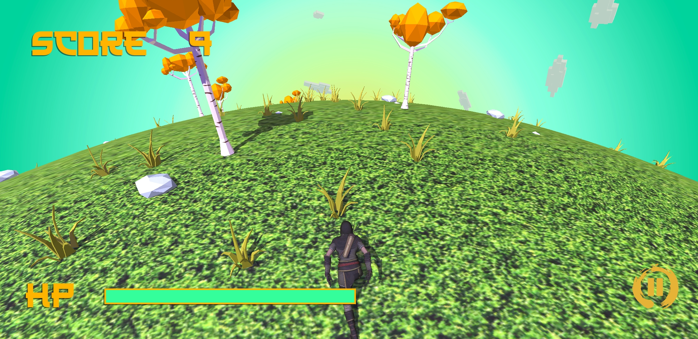

<!-- Improved compatibility of back to top link: See: https://github.com/othneildrew/Best-README-Template/pull/73 -->

<!--
*** Thanks for checking out the Best-README-Template. If you have a suggestion
*** that would make this better, please fork the repo and create a pull request
*** or simply open an issue with the tag "enhancement".
*** Don't forget to give the project a star!
*** Thanks again! Now go create something AMAZING! :D
-->

<!-- BADGES -->

<!-- PROJECT LOGO -->

  

  <h3 align="center">🪐 Plannet Runner 🪐</h3>

  

    🐱‍👤 A ninja’s endless dash through raining asteroids - just another day in the dojo of space! 🐱‍👤
  

<!-- ABOUT THE PROJECT -->
## About The Project

<table width="100%">
  <tr>
    <td width="50%" align="center">
      
      
Menu Scene

    </td>
    <td width="50%" align="center">
      
      
Run!

    </td>
  </tr>
  <tr>
    <td width="50%" align="center">
      
      
I believe I can fly!!!

    </td>
    <td width="50%" align="center">
      
      
Try again?

    </td>
  </tr>
</table>

🎯**Purpose**🎯 Showcase project from the third semester at Toronto Film School's video game development program.

📚**What I Learned**📚
- **Level Design Principles and Techniques**: I developed a solid understanding of how to craft engaging and challenging levels, focusing on player experience and progression.
- **Procedural Level Generation**: I gained hands-on experience in creating algorithms that dynamically generate levels, ensuring each playthrough offers a unique experience.
- **Animation Editing**: I learned to work with existing animation assets, refining them to fit the game’s style and requirements. This included adjusting timing, blending animations, and ensuring smooth transitions between different character states.

🛠️**What I Implemented**🛠️
- **Complete Game Loop Integration**: I successfully integrated all components of the game loop, from initializing the game to handling player inputs, managing game states, and finalizing the gameplay experience with ending condition.
- **Game Logic Development**: I built and refined the core logic that drives the game's mechanics, ensuring that player actions result in expected and enjoyable outcomes. This included collision detection, score calculation, and difficulty scaling.
- **Audio Cue Incorporation**: I integrated audio cues throughout the game, enhancing the player’s immersion and feedback. This involved selecting and timing sound effects to correspond with in-game events, such as explosion, hits, and level completions.

(<a href="[top]">back to top</a>)

<!-- CONTACT -->
## Contact

Vi Tiet - [Portfolio](https://ttvpro007.github.io/) - vitiet.programmer@gmail.com

Project Link: [https://github.com/ttvpro007/Planet-Runner](https://github.com/ttvpro007/Planet-Runner)

(<a href="[top]">back to top</a>)

[top]: readme-top
